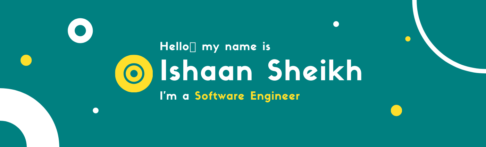

My name is [Ishaan Sheikh](https://frikishaan.com). I am a software engineer from India. I like learning new technologies and building things.

### ✅ Technologies I worked with
- Laravel (PHP)
- JavaScript
- HTML
- CSS
- Python

### 💻 I'm learning
- C# (.NET)
- Machine Learning 
- Data Structure & Algorithm

### 🎯 My Goals for 2020
- Read atleast 3 books
- Learn Docker and other DevOps techniques
- Learn Machine Learning
- Create a SaaS product (I haven't got any idea yet 😕)

### 🔗 Links
- 📧 [Email](mailto:hey@frikishaan.com)
- 🐦 [Twitter](https://twitter.com/imishaan005)
- ⭐ [LinkedIn](https://www.linkedin.com/in/ishaan-s/)
- 🖌 [Codepen](https://codepen.io/sheikh_ishaan/)
- 🌐 [Website](https://frikishaan.com)
<!--
**sheikh005/sheikh005** is a ✨ _special_ ✨ repository because its `README.md` (this file) appears on your GitHub profile.

Here are some ideas to get you started:

- 🔭 I’m currently working on ...
- 🌱 I’m currently learning ...
- 👯 I’m looking to collaborate on ...
- 🤔 I’m looking for help with ...
- 💬 Ask me about ...
- 📫 How to reach me: ...
- 😄 Pronouns: ...
- ⚡ Fun fact: ...
-->
